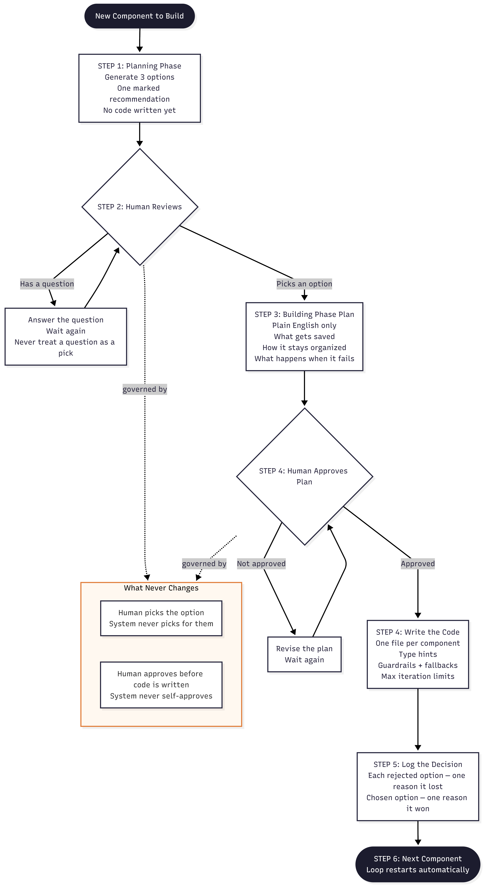

# Human-First Build Protocol

A controlled, component-by-component build loop for shipping 
production-grade agentic AI systems — where the human approves 
every decision before any code is written.

## The Problem It Solves

Most AI systems are built fast and fixed later. The AI generates 
code, the human reviews it after the fact, and decisions about 
why one approach was chosen over another are never recorded. 
When something breaks in production — or when someone asks 
"why did you build it this way?" — there is no answer.

This protocol reverses that. Every component is planned before 
it is built. Every option is presented before one is chosen. 
Every rejected option is logged with the reason it lost. 
The human is never bypassed.

## How The Loop Works

The loop runs once per component — state schema, each agent, 
the router, graph assembly, and so on.

**Step 1 — Planning Phase**
Three implementation options are generated for the component 
being built. Each option includes how it works, its tradeoffs, 
and a single marked recommendation with reasoning. No code 
is written yet.

**Step 2 — Human picks**
The human selects an option or asks a question. A question 
is never treated as a pick. The loop waits.

**Step 3 — Building Phase plan**
Once an option is picked, a plain-English build plan is 
generated — what gets saved, how it stays organized, what 
happens when something goes wrong. No code yet. The loop 
stops and waits for approval.

**Step 4 — Human approves**
The human approves the plan. Only then is code written — 
modular, one file per component, with type hints, guardrails, 
fallbacks, and max iteration limits built in.

**Step 5 — Decision log**
Every rejected option is recorded by name with the one 
specific reason it lost. The chosen option is recorded with 
the one specific reason it won. This log is what lets you 
defend every decision out loud — in a code review, 
an audit, or an interview.

**Step 6 — Next component**
The moment the decision is logged, the next component's 
planning phase begins automatically. The loop repeats.

## What Never Changes

- The human picks the option. The system never picks for them.
- The human approves the plan before any code is written. 
  The system never self-approves and proceeds.

These two moments are the actual point of the protocol. 
The human's judgment is what is being built, not just the code.

## What It Produces

- Ship-ready, modular agentic system code
- A complete auditable decision log per project
- Defensible answers to every architectural choice made
- Zero surprise decisions buried in generated code

## Applied To

Six production-grade agentic systems across Construction Tech, 
Healthcare, and FinTech — used in combination with the 
Agentic Blueprint framework for architecture decisions.

## What Is Not In This Repo

The project-specific prompts, decision logs, and generated 
code are not published here. This repo documents the 
protocol only.
