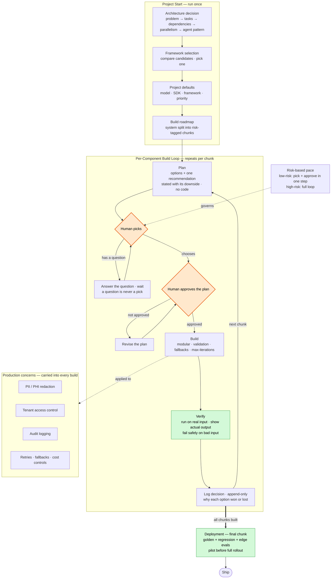

# Human-First Build Protocol

A controlled, component-by-component build loop for shipping 
production-grade agentic AI systems — where a human approves 
every decision before any code is written.

## The Problem It Solves

Most agentic systems are built fast and patched later. The AI 
writes code, the human reviews it after the fact, and the reasoning 
behind each architectural choice is never recorded. When something 
breaks in production — or an auditor asks "why was it built this 
way?" — there is no answer, and often no one ran the thing end to 
end to check it in the first place.

This protocol reverses that. Every component is planned before it 
is built, every option is weighed before one is chosen, every 
component is run and shown working before the loop advances, and 
every decision is logged with the reason it won. The human is 
never bypassed.

## What It Prevents

The loop is built against the specific ways agentic systems fail 
in production:

- **Silent failures** — components that ship without ever being 
  run. A verify step blocks the loop until real output is shown, 
  including safe failure on bad input.
- **Undocumented decisions** — "why not the other approach?" with 
  no answer months later. Every choice is logged with the specific 
  reason each rejected option lost.
- **Rubber-stamped architecture** — approvals the human didn't 
  really weigh. Every recommendation is presented alongside its 
  own strongest counter-argument.
- **Audit gaps** — decisions quietly rewritten to match the final 
  code. The log is append-only; reversals are recorded as 
  amendments, never edits.
- **One-size-fits-all risk** — trivial and safety-critical 
  components treated identically. Each component is risk-tagged 
  and paced accordingly.

## How It Works

The system is built one component at a time — state schema, each 
agent, the router, graph assembly, deployment. Each component runs 
the same loop:

**Plan → Pick → Approve → Build → Verify → Log → next.**

- **Plan** — options are proposed with tradeoffs and a single 
  recommendation, stated with its downside. No code yet.
- **Pick** — the human chooses. A question is never treated as 
  a pick.
- **Approve** — a plain-English build plan is shown and approved 
  before any code exists. Rejected plans are revised, not overridden.
- **Build** — modular code, one file per component, with validation, 
  fallbacks, and max-iteration limits built in.
- **Verify** — the component is run on real input and the actual 
  output is shown before anything advances.
- **Log** — the decision, and why the alternatives lost, is 
  recorded in an append-only trail.

Two gates are never automated away: the human picks the option, and 
the human approves the plan before code exists. Low-risk components 
can take a faster path; high-risk ones always run the full loop.

Underneath, each build treats production concerns as first-class 
requirements — PII/PHI redaction, tenant access control, audit 
logging, retries and fallbacks, cost controls, and evaluation 
against known-answer test sets before launch.

## Results

Applied to six production-grade agentic systems across three 
regulated domains — Construction Tech, Healthcare, and FinTech.

In practice, the protocol changed how the systems were built:

- Architectural choices were caught and revised at the human gate — 
  before any code was written, not after it shipped.
- Every component was run and shown working before the next began, 
  so integration problems surfaced early instead of at final assembly.
- Each system carries a complete, append-only decision record — 
  every choice defensible in a code review, an audit, or an interview.
- Sensitive-data systems were built with redaction, tenant isolation, 
  and audit logging as first-class requirements from the first component.

## What Is Not In This Repo

The operating instructions, prompt templates, architecture 
framework, decision logs, and generated code are not published 
here. This repository documents the protocol's purpose, shape, 
and results — not the method used to run it.

## The Protocol at a Glance

